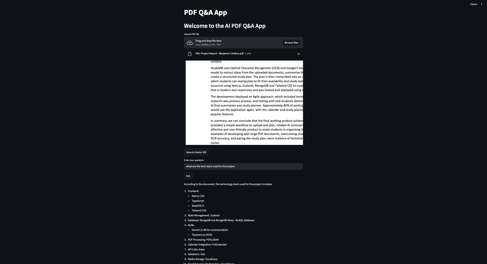

# Project PDF Q&A Chat Bot

Welcome to **PDF Q&A Chat Bot**! This project is designed to help users interactively ask questions about PDF documents and get intelligent, accurate responses using natural language processing techniques.

## Features

- **PDF Upload:** Upload PDF documents for analysis.
- **Intelligent Q&A:** Ask questions in natural language about the contents of uploaded PDFs.
- **Chat Interface:** User-friendly chat UI for seamless interaction.
- **Text Extraction:** Efficiently extracts text from PDFs for processing.
- **Contextual Search:** Finds relevant answers from the PDF using semantic search.
- **Scalable Backend:** Easily extensible architecture for adding new features.

## Technologies Used

- **Python** (core backend)
- **Streamlit** (web UI)
- **PyPDF** (PDF text extraction)
- **OpenAI API / Hugging Face Transformers** (LLMs for Q&A)
- **LangChain** (optional, for chaining NLP tasks)

## How It Works

1. **User uploads a PDF** via the web interface.
2. The system extracts text from the PDF using text extraction libraries.
3. The user submits a question about the document.
4. The chatbot processes the question using NLP and searches the PDF text for the most relevant answer.
5. The answer is returned in the chat interface.

## Getting Started

### Prerequisites

- Python 3.8+
- pip (Python package manager)
- API keys for OpenAI or Hugging Face (if using LLMs)

### Installation

1. **Clone the repository:**

   ```bash
   git clone https://github.com/Benjamin-chidera/project-PDF-Q-A-CHAT-BOT.git
   cd project-PDF-Q-A-CHAT-BOT
   ```

2. **Install dependencies:**

   ```bash
   pip install -r requirements.txt
   ```

3. **Set up environment variables:**

   - For OpenAI:  
     `export OPENAI_API_KEY=your_openai_api_key`

   - For Hugging Face:  
     `export HF_API_KEY=your_huggingface_api_key`

4. **Run the app:**

   ```bash
   streamlit run app.py
   ```

## Usage

- Open your browser and go to the local Streamlit server (usually `http://localhost:8501`).
- Upload a PDF.
- Ask any question about its content using the chat interface.
- Get instant, relevant answers!

## Example



## Contributing

Contributions are welcome! If you'd like to improve this project, feel free to submit a pull request, create issues, or suggest features.

## License

This project is licensed under the MIT License.

## Contact

For questions or support, please open an issue on GitHub or contact [Benjamin-chidera](https://github.com/Benjamin-chidera).

---

*Happy chatting with your PDFs!*
